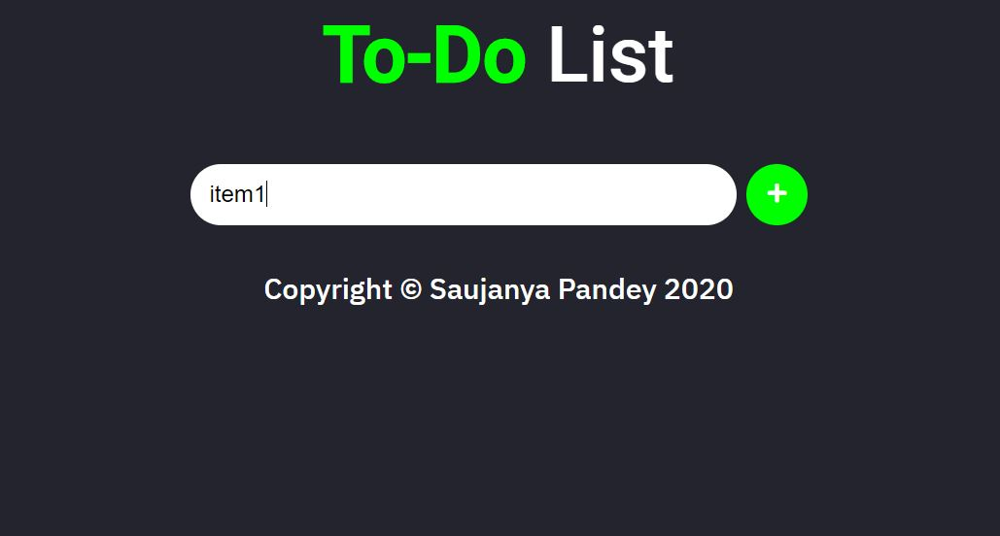
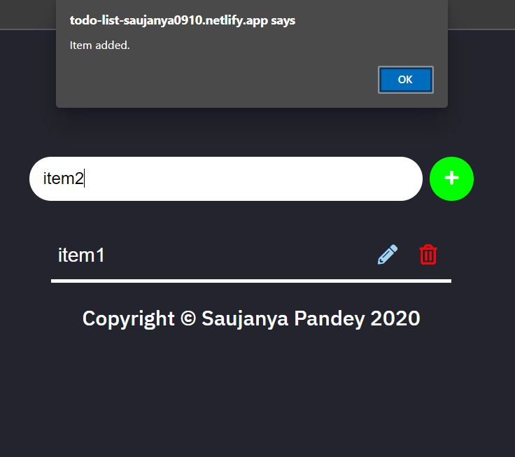
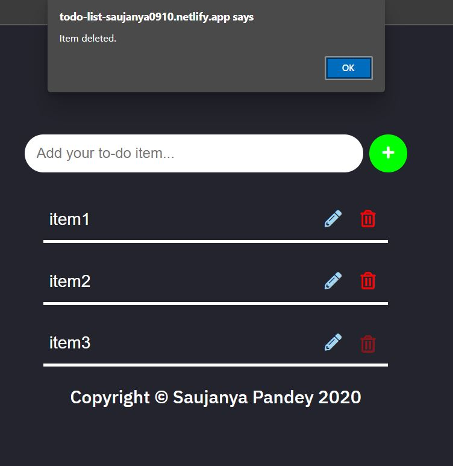

# Todo-List-JS
This is a simple Todo-List app made using HTML, CSS, and vanilla Javascript. 

# How to run:
* Download the entire repository.
* Run the `index.html` file

# Functionalities:
* Add your to-do item with a simple mouse-click/Enter button.
* Edit the items by clicking the 'pencil' icon and confirm the edit by pressing it again.
* Delete any item by clicking the 'trash' icon.
* Stores all items in the browser's local storage so your list is never lost until delete.
* Add your items hassle free no need for login/signup.

# Screenshots:

